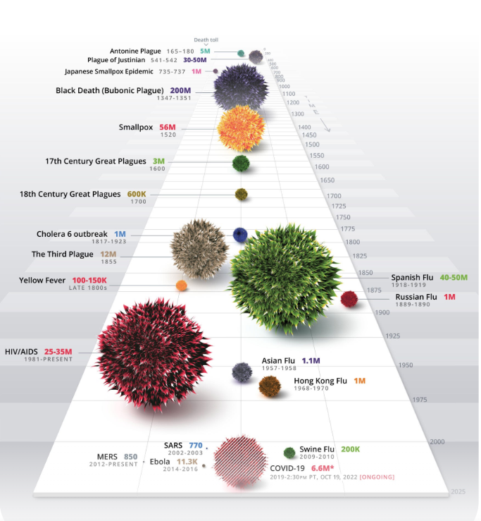

 # GLOBAL-DISEASE-DATASET

 ## INTRODUCTION
The dataset provides a comprehensive historical overview of 50 major pandemic and epidemic events spanning from the Ancient era (2nd Century) to the Contemporary era (21st Century). It includes key metrics such as pathogen types, estimated cases and deaths, case fatality rates (CFR), primary transmission methods, and the resulting economic impact in billions of USD. This data allows for a longitudinal study of how humanity has been affected by infectious diseases and how medical breakthroughs have evolved to contain them.

## INSIGHT
- **Pathogen Dominance**: Viruses and Bacteria are the most frequent causes of global health crises. While bacterial infections like the Black Death and Plague of Justinian caused the highest historical mortality, the modern era is dominated by viral outbreaks (e.g., Influenza, Ebola, COVID-19).
- **Mortality Extremes**: The Black Death remains the most catastrophic event in recorded history with an estimated 75 million deaths, followed by the Spanish Flu and the Plague of Justinian. The data shows a "Catastrophic" mortality scale is typically associated with a Case Fatality Rate (CFR) above $30\%$.
- **Economic Escalation**: There is a massive spike in economic impact in the Contemporary Era. Modern pandemics (like COVID-19, which is reflected in high-impact contemporary data) cause trillion-dollar disruptions due to the interconnected nature of global trade, compared to the localized economic shifts of ancient times.
- **Containment Evolution**: Early historical events relied almost exclusively on Natural Decline or primitive isolation. In contrast, 21st-century events show a high frequency of Medical Breakthroughs (vaccines and antibiotics), yet the "Spread Score" remains high due to increased global mobility.
- **Geographic Spread**: While many ancient plagues were "Continental," modern outbreaks quickly reach "Global" status, affecting all 6-7 inhabited continents within months.

## RECOMMENDATION
- **Strengthen Viral Surveillance**: Given that viruses are the most frequent drivers of contemporary epidemics, global health systems should prioritize early genomic sequencing and rapid vaccine platform development.
- **Economic Buffering**: Since the economic impact of pandemics has grown exponentially, nations should invest in "pandemic insurance" and robust social safety nets to mitigate the multi-billion dollar losses seen in recent decades.
- **Targeted Vector Control**: Many of the deadliest historical events (Plagues) were vector-borne (e.g., fleas/rats). Maintaining high standards of urban sanitation and pest control remains a fundamental pillar of pandemic prevention.
- **Investment in "Low-Scale" Outbreaks**: Data shows that even "Minimal" mortality events can have high economic costs. Early containment of regional epidemics (like Ebola or MERS) is significantly more cost-effective than managing a full-scale pandemic.

## CONCLUSION
The dataset illustrates a clear transition in human history: we have moved from an era of high mortality/low economic impact (Ancient/Medieval) to an era of lower mortality (per capita)/extreme economic impact (Contemporary). While medical science has successfully lowered the Case Fatality Rate for many pathogens, the speed of global spread and the complexity of modern economies have made us more vulnerable to financial collapse during health crises. The history of pandemics proves that while pathogens evolve, our primary defenses remain a combination of rapid medical intervention and coordinated global containment strategies.
